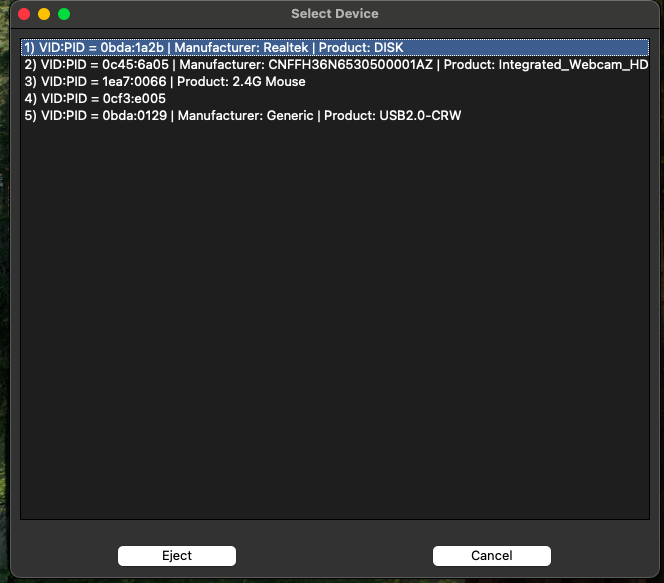

# Eject2Net

This MacOS + Linux utility automates the process of ejecting USB devices that initially appear as virtual CD-ROM drives containing drivers (such as some Wi-Fi adapters and modems), allowing the device to switch to its intended working mode without manual intervention.

## How to Use

## Download precompiled application

You can download a ready-to-use precompiled **MacOS** application from the "Releases" section on the project's GitHub page. This is the easiest way to get started if you do not want to build from source.

### Modes

The utility works in both console (command-line) and graphical modes. You can run it from the terminal as shown above, or use the included macOS GUI application `Eject2Net.app` (double-click it in Finder or run `open Eject2Net.app`). A screenshot of the GUI is shown below:



### 1. Build the Project

To compile the `Eject2Net` utility, a `Makefile` is provided for both **macOS** and **Debian-like Linux** distributions.

#### Compile

Compile the project using `make`:
```bash
make
```
This will create an executable file named `Eject2Net` in the project root directory.

### 2. Run the Utility

Execute the compiled program:
```bash
sudo ./Eject2Net
```

The program will list all connected USB devices with their Vendor ID (VID) and Product ID (PID), along with their manufacturer and product names if available.

```
Connected USB devices:
 1) VID:PID = 046d:c52b | Manufacturer: Logitech | Product: USB Receiver
 2) VID:PID = 0bda:8179 | Manufacturer: Realtek | Product: 802.11n WLAN Adapter
Enter the number of device to eject:
```

### 3. Select a Device

Enter the number corresponding to the USB device you wish to eject (the one acting as a virtual CD-ROM). The tool will then send the ejection command to that device.

```
Enter the number of device to eject: 2
Ejecting device 0bda:8179 ...
Using interface 0: ep_out=0x02 ep_in=0x81
CBW sent (31 bytes)
Eject command successful, CSW status=0x00
```

After a successful ejection, your device should now be recognized by the system in its intended mode, and you can proceed with driver installation or usage.


# Eject2Net (Русский)

Эта MacOS + Linux утилита автоматически извлекает USB-устройства, которые изначально определяются как виртуальный CD-ROM с драйверами (например, некоторые Wi-Fi адаптеры и модемы), чтобы устройство сразу переходило в рабочий режим без ручных действий.

## Как пользоваться

## Скачивание заранее скомпилированного приложения

Вы можете скачать готовое MacOS приложение в разделе "Releases" на странице проекта GitHub. Это самый простой способ начать работу, если вы не хотите собирать программу из исходников.

### Режимы

Программа работает как в консольном режиме, так и с графическим интерфейсом. Запустите её из терминала (см. выше) или используйте прилагаемое macOS GUI-приложение `Eject2Net.app` (двойной клик в Finder или `open Eject2Net.app`). Ниже приведён скриншот интерфейса:


### 1. Сборка проекта

Для компиляции утилиты `Eject2Net` предоставляется `Makefile` как для macOS, так и для дистрибутивов Linux на базе Debian.

#### Компиляция

После установки зависимостей скомпилируйте проект с помощью `make`:
```bash
make
```
Это создаст исполняемый файл с именем `Eject2Net` в корневом каталоге проекта.

### 2. Запуск утилиты

Запустите скомпилированную программу:
```bash
sudo ./Eject2Net
```

Программа выведет список всех подключенных USB-устройств с их Vendor ID (VID) и Product ID (PID), а также названиями производителя и продукта, если они доступны.

```
Connected USB devices:
 1) VID:PID = 046d:c52b | Manufacturer: Logitech | Product: USB Receiver
 2) VID:PID = 0bda:8179 | Manufacturer: Realtek | Product: 802.11n WLAN Adapter
Enter the number of device to eject:
```

### 3. Выбор устройства

Введите номер, соответствующий USB-устройству, которое вы хотите извлечь (то, которое действует как виртуальный CD-ROM). Затем инструмент отправит команду извлечения этому устройству.

```
Enter the number of device to eject: 2
Ejecting device 0bda:8179 ...
Using interface 0: ep_out=0x02 ep_in=0x81
CBW sent (31 bytes)
Eject command successful, CSW status=0x00
```

После успешного извлечения ваше устройство должно быть распознано системой в его предполагаемом режиме, и вы сможете продолжить установку драйверов или использование.

